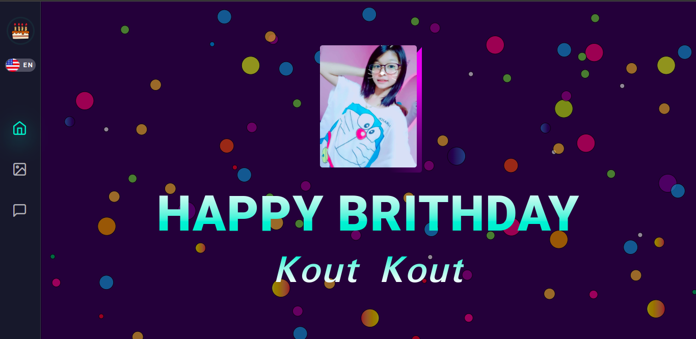

PURPOSE => This mini project target on my love's birthday.

DURATION => I build this project about 5 days because In the days of military coup In MYANMAR , the electricity has been cut off about 18 hours in a day.So this mini project takes a little bit long time.

PROBLEM => There is no such big problem in this , but just a little is I use (IntersectionObserver) to animate the wishes card by adding a class(show-wish-card-container) when the card is Intersecting. Everything is fine till right here.But when i change language , IntersectionObserver is doesn't work again. Yes , My bad!. So I put this IntersectionObserver inside a function and i call it everytime after i change language and it's work incredible.
